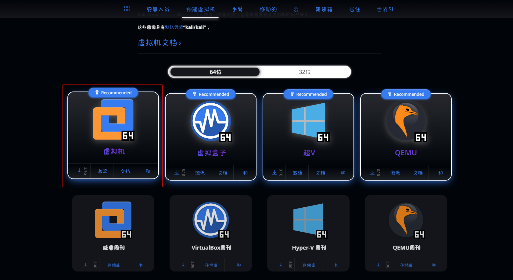
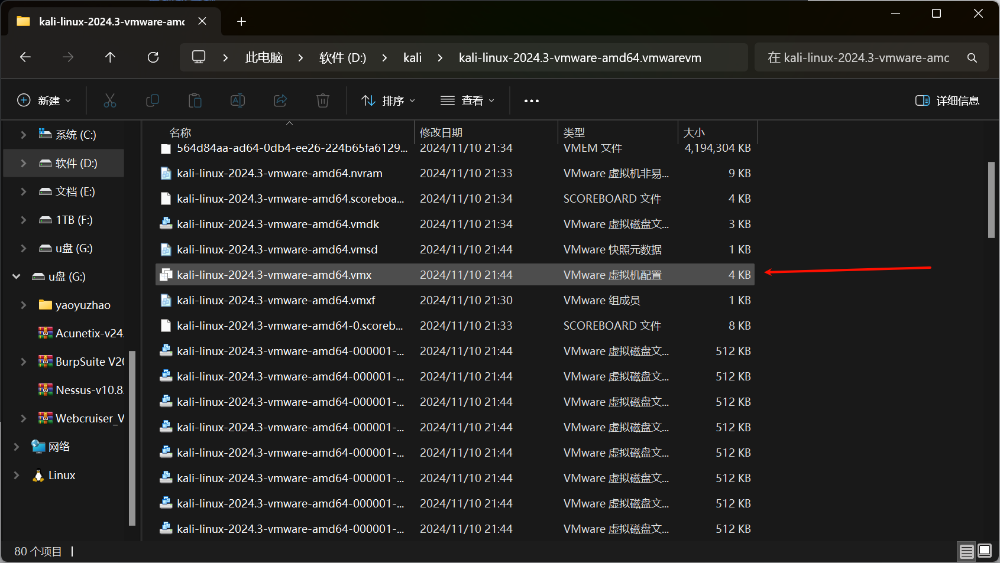
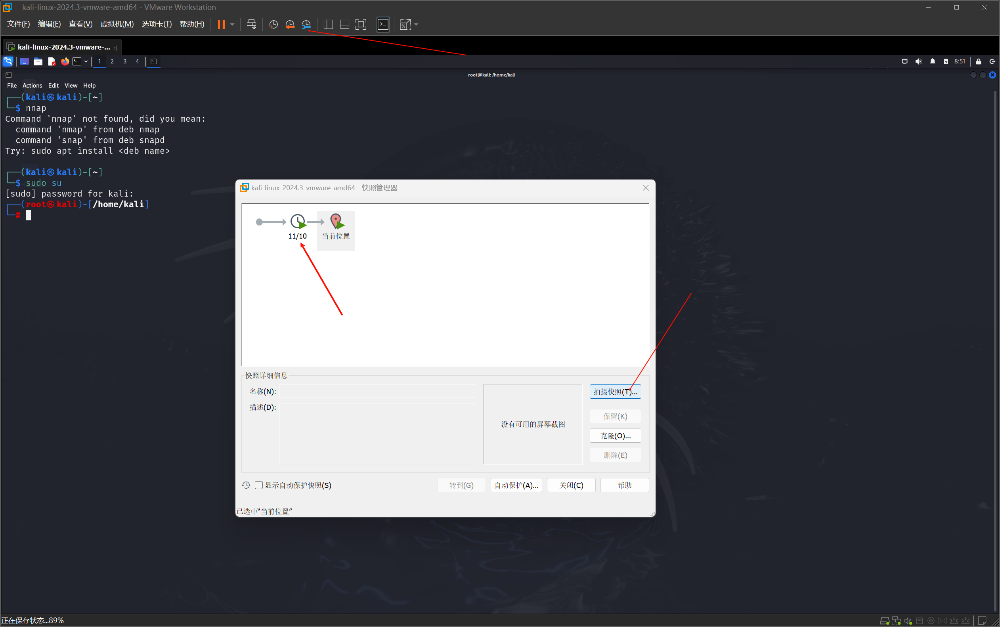
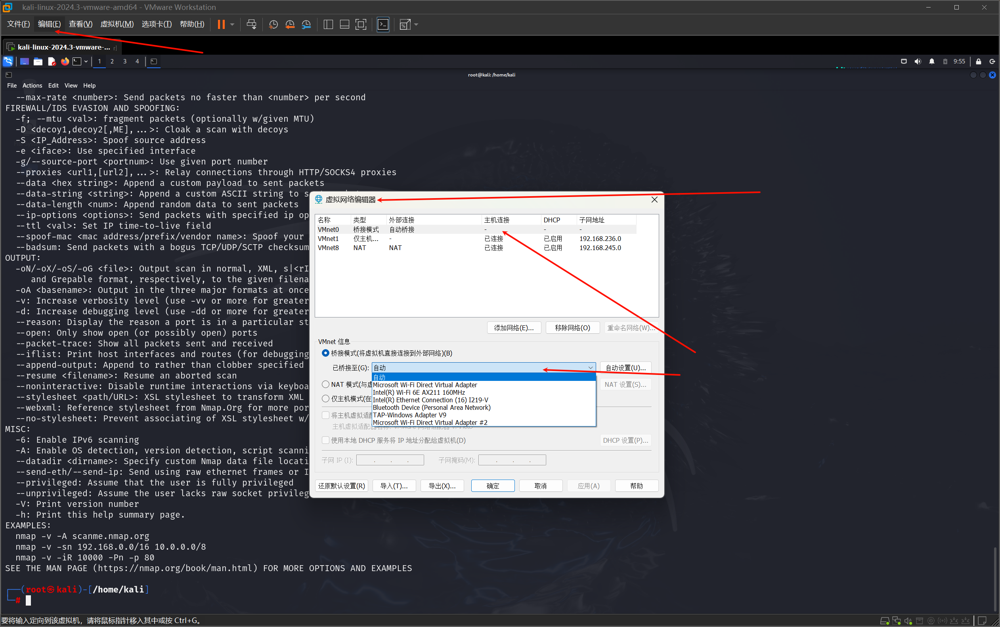

# kali安装

# VMwareWorkstation安装

密钥【MC60H-DWHD5-H80U9-6V85M-8280D】

|下载通道**①**迅雷云盘丨下载链接：<br /><br />[https://pan.xunlei.com/s/VO5vyCixCHg05GhqfwdlavyhA1?pwd=84cu](https://pan.xunlei.com/s/VO5vyCixCHg05GhqfwdlavyhA1?pwd=84cu)|
| ----------------------------------------------|
|下载通道**②**百度网盘丨下载链接：<br />[https://pan.baidu.com/s/1nns2lfn4bNaS4HuPObUncA?pwd=6789](https://pan.baidu.com/s/1nns2lfn4bNaS4HuPObUncA?pwd=6789)<br />提取码：6789|

# kali下载

root

616420

[获取时间 |卡利Linux --- Get Kali | Kali Linux](https://www.kali.org/get-kali/#kali-virtual-machines)

​​

## 打开kali

​​

解压的kali文件夹中打开vmx文件即可打开kali虚拟机

## 登录kali

默认账户密码

kali

​​

## 快照创建

​​

# ip地址查看

* 官方:

  ```undefined
  ip a
  ```

* 常用:

  ```undefined
  ifconfig
  ```

# 网络设置

如果网络无法连接,可在虚拟网络编辑器中修改桥接网路

​​
